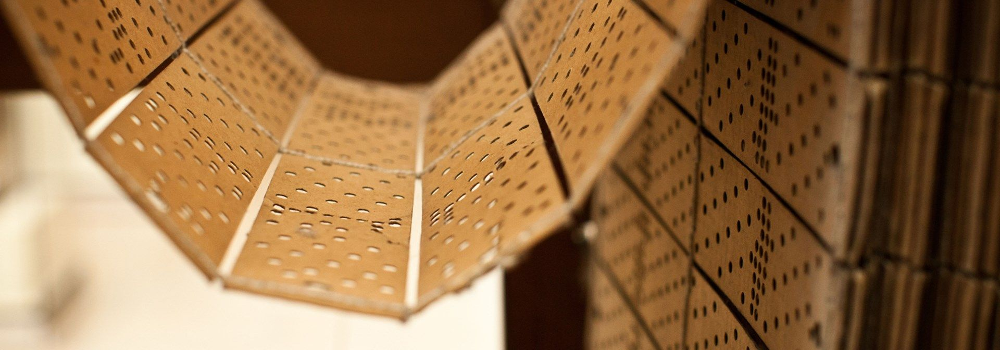
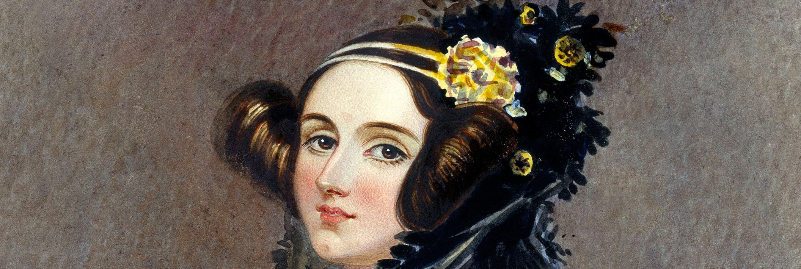

**A.D.A.** is a robotic work, made in collaboration with [ceiborg](https://ceiborg.com/), that autonomously weaves neo-representations of the chakana, synthesis of the Andean cosmovision.  

The name refers to an “Algorithmic Designs Self-Weaving Machine” (“Autotejedora de Diseños Algorítmicos” in Spanish) , also celebrating 
the techno-poetic approach of Ada Lovelace, whom we see as the nexus between the most primitive weaving techniques and current computer science.

> In the center of a quiet, empty-walled room, a strange machine displays extensive weave. 
> There is also a percussion of two drums without fanfare, which seems to come from the same place, repeating an almost ritual sequence. 
> Every so often and autonomously, the carriage moves from one side to the other, spreading the weave. 
> And as it does, the percussive sequence changes. 
> -- Might they be related?
> The pattern of the fabric is somewhat abstract, but reminiscences of Andean symbols can be perceived. 
> And while the cadence of the percussion suggests repetition, the weave shows that what is constant is change.
> The pace of work is so slow that rigor of mass production does not fit the scene. 
> -- But, what is this machine about?
> It weaves without haste, giving the impression of doing conscious work, displaying a drawing that, 
> more than a garment, looks like a parchment.
> Like a solitary intelligence whose mission is to preserve a primitive message.

---   

Let’s think for a moment about the spindle: an ancient tool to generate twist yarns from
vegetable and animal fibers, which later resulted in more complex garments thanks to
the loom. The spindle and the loom, two of the most revolutionary inventions of the Neolithic
Age, show that technology was always present in the craftsman’s work.

In the history of the original peoples of Argentina, various techniques were used to make fabrics. 
From north to south, each town interpreted and shaped their vision of the world with materials and techniques typical of the place. 
Despite geographic and cultural differences, we find common meanings in their various representations. 

---   

The chakana (or Andean cross) is a recurring symbol that means “ladder to the highest” and constitutes the synthesis of the Andean cosmovision.  
When these peoples wanted to capture their worldview, they represented their symbols with the technology at their disposal. 
If they hadn’t found the spindle yet, we might have found the chakana in cave paintings. 
But since they were skilled with the loom, their message reaches us through their fabrics. 

How could we today, with our current technology, continue their legacy?

> One up, one down, color change, I go back in the opposite direction ...

From a simple braid to the most intricate weft, the art of weaving obeys a set of neat and defined rules. 
This knowledge, these precise instructions, were transmitted from generation to generation by these peoples who, perhaps without knowing it, 
left samples of algorithmic art in their early tissues.

---   

In this unique intersection between looms and algorithms, and in the days of punched card Jacquard looms, the fanciful idea arises of
building a loom applied to numbers, that is, a computer.   
Isn’t it amazing that all the computer technology we know today is somehow tied to traditional looms?

Ada Lovelace was a mathematician, writer and, according to her, scientist, poet and analyst.   
In her notes on Charles Babbage’s Analytical Engine, she wrote the first algorithm intended to be processed by a machine, 
thus becoming the first programmer. 

In these same notes, she predicted that this machine *could act on other things besides number, 
if objects were found whose mutual fundamental relationships could be expressed by those of the abstract science of operations*.

> Would it be possible to use this type of artifice to create neo-representations of the chakana?
> Can we abstract the formal characteristics of the chakana and generate reinterpretations of the symbol?

Ada encourages us to suspect so, who a century before the invention of the first computer, and referring to a machine that was never built, 
left among technical notes poems like this one:

> "The Analytical Engine weaves algebraic patterns, just as the Jacquard loom weaves flowers and leaves."

<iframe src="/en/labs/ada/?embed" width="100" height="100" style="border:0;overflow:hidden" scrolling="no"></iframe>

---   
For more information about the algorithm A.D.A use to weave, [follow this link](/en/labs/ada)
