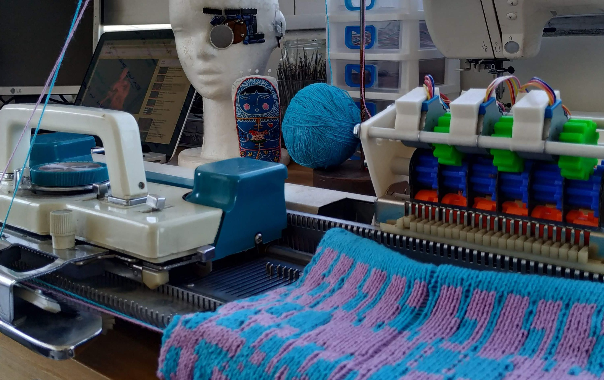
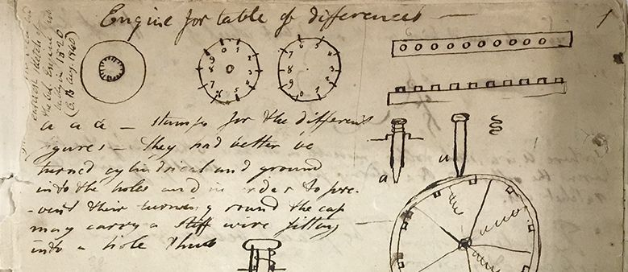

**A.D.A.** es una obra robótica, realizada en colaboración con [ceiborg](https://ceiborg.com/), que teje autónomamente neo-representaciones de la chakana, síntesis de la cosmovisión andina.   

Su nombre se refiere a una "Autotejedora de Diseños Algorítmicos", celebrando además el enfoque tecno-poético de Ada Lovelace, a quien vemos
como el nexo entre las más primitivas técnicas de tejido y las actuales ciencias de la computación. 

> En el centro de una sala tranquila y de paredes vacías, una máquina extraña exhibe un tejido extenso.  
> Se escucha además una percusión de dos tambores sin estridencias, que parece provenir del mismo sitio, repitiendo una secuencia casi ritual.  
> Cada cierto tiempo y de forma autónoma, el carro se mueve de un lado hacia el otro extendiendo el tejido.  Y al hacerlo, la secuencia percusiva cambia.  
> -- ¿Estarán relacionados?  
> El dibujo del tejido es algo abstracto, pero pueden intuirse reminiscencias de símbolos andinos. 
> Y mientras que la cadencia de la percusión sugiere repetición, el tejido demuestra que lo constante es el cambio.  
> El ritmo de trabajo es tan pausado que no cuadra en la escena el rigor de la producción en masa.   
> -- Pero, ¿de qué se trata esta máquina?  
> Teje sin apuro, dando la impresión de estar realizando un trabajo consciente, desplegando un dibujo que, 
> más que una prenda, parece un pergamino.  
> Como una inteligencia solitaria cuya misión es preservar un mensaje primitivo.   

---   

Pensemos por un momento en el huso: una antigua herramienta para generar hilados por
torsión de fibras vegetales y animales, que luego dieron lugar a prendas más complejas
gracias al telar. El huso y el telar, dos de los inventos más revolucionarios del Neolítico, dan
cuenta de que la tecnología siempre estuvo
presente en el trabajo del artesano.

En la historia de los pueblos originarios de Argentina, se utilizaron diversas técnicas para la
elaboración de tejidos. Desde el norte hasta el sur, cada pueblo interpretó y plasmó su visión
del mundo con materiales y técnicas propias del lugar. A pesar de las diferencias geográficas y culturales, encontramos significados
comunes en sus diversas representaciones.

---   

La chakana (o cruz andina) es un símbolo recurrente que significa “escalera hacia lo más
elevado” y constituye la síntesis de la cosmovisión andina.
Cuando estos pueblos quisieron plasmar su cosmovisión, representaron sus símbolos con la tecnología que tenían a su disposición.
Si no hubiesen dado aún con el huso, tal vez habríamos hallado la chakana en pinturas rupestres. Pero como eran diestros con el telar,
su mensaje nos llega a través de sus tejidos.

¿Cómo podríamos hoy, con la tecnología actual, continuar con su legado?

> Uno para arriba, uno para abajo, cambio de color, vuelvo en sentido contrario…

Desde una simple trenza hasta la trama más intrincada, el arte del tejido obedece a un conjunto de reglas ordenadas y definidas. Este
conocimiento, estas instrucciones precisas,
fueron transmitidas de generación en genera ción por estos pueblos que, tal vez sin saberlo, dejaron en sus tejidos tempranas muestras de arte algorítmico.

---   

En este cruce tan singular entre telares y algoritmos, y en los tiempos de los telares de Jacquard de tarjetas perforadas, 
surge la fantasiosa idea de construir un telar aplicado a los números, es decir, una computadora. 
¿No es asombroso que toda la tecnología de cómputo que hoy conocemos esté de algún modo ligada a los telares tradicionales?

Ada Lovelace fue una matemática, escritora y, según ella, científica poetisa y analista. 
En sus notas sobre la Máquina Analítica de Charles Babbage, dejó escrito el primer algoritmo
destinado a ser procesado por una máquina, convirtiéndose así en la primera programadora. 

En estas mismas notas, auguró que esta máquina 
*podría actuar sobre otras cosas además del número, si se encontraran objetos cuyas relaciones fundamentales
mutuas pudieran ser expresadas por las de la ciencia abstracta de las operaciones*.

> ¿Será posible utilizar este tipo de artificios para crear neo-representaciones de la chakana?   
> ¿Podremos abstraer las características formales de la chakana y generar reinterpretaciones del símbolo?

Nos anima Ada a sospechar que sí, quien un siglo antes de la invención del primer computador, y refiriéndose a una máquina que nunca se construyó,
dejó entre notas técnicas poemas como el siguiente:

> "La Máquina Analítica teje patrones algebraicos, al igual que el telar Jacquard teje flores y hojas."

