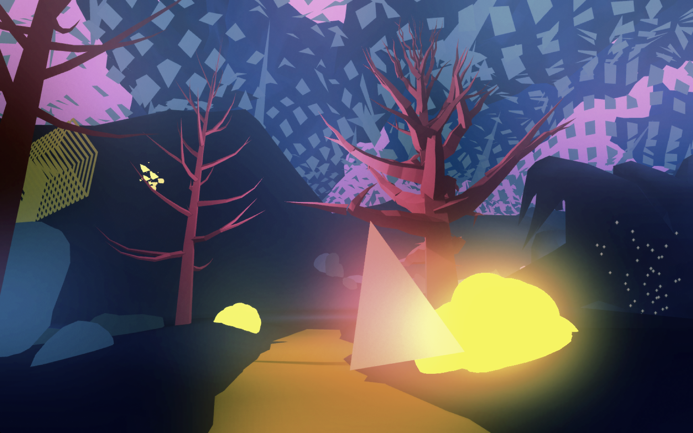
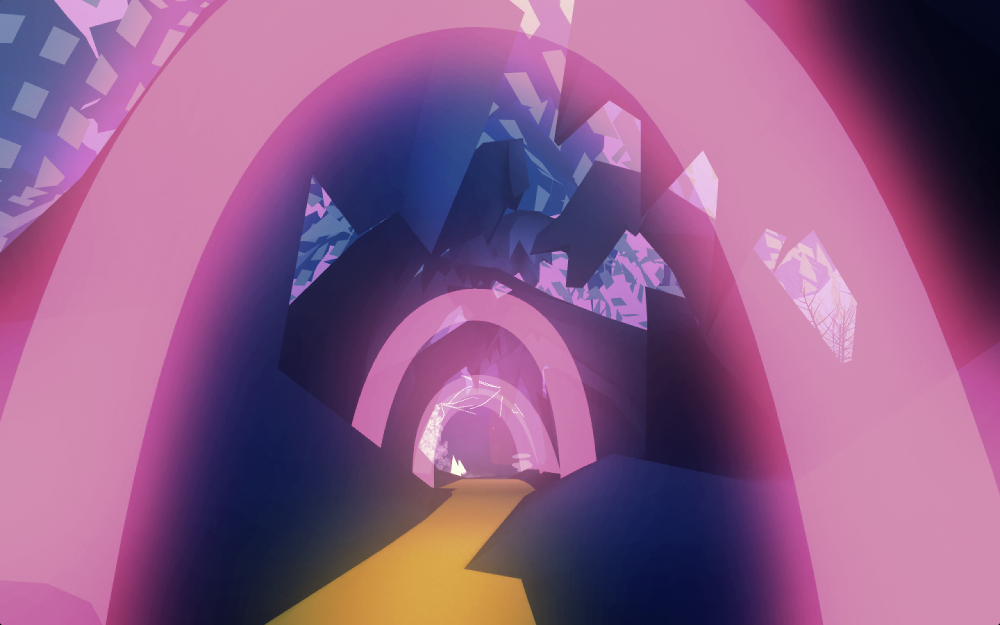

**Blue Mountain** is a musical and pictorial journey of beautiful soundscapes and fantastic nature that leads to a peaceful contemplation.

An exploratory audiovisual landscape approached through virtual reality technology. Each element that conform the virtual environment has a certain pictorial-musical representation. Depending on which path the user takes, the sound environment is modified as it moves through space.

[Visit the old project site](https://diegodorado.com/blue-mountain/)

## Watch the trailer
<iframe src="https://www.youtube.com/embed/ONDT5KO7gb8" title="" allow="fullscreen" loading="lazy" allowfullscreen frameborder="0"></iframe>

